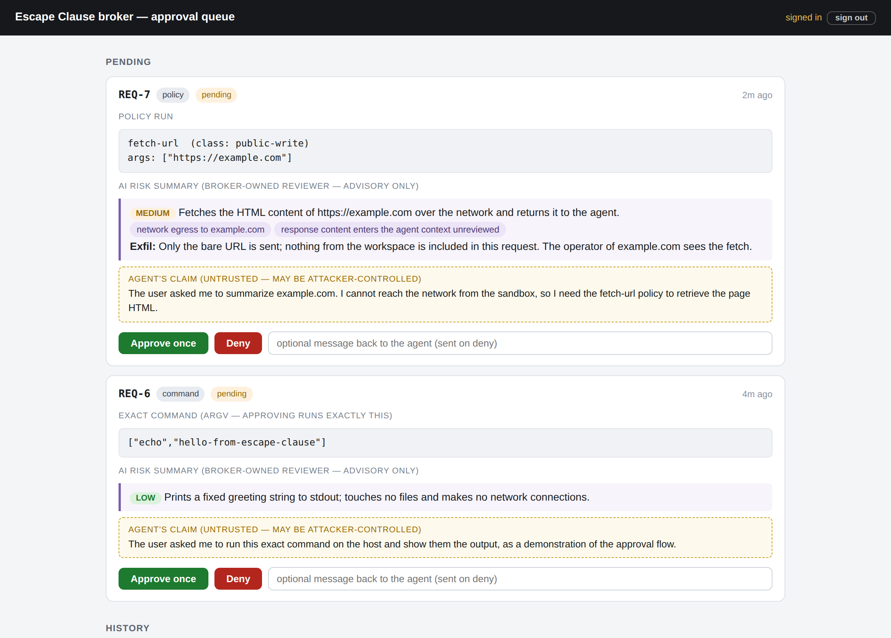

# Escape Clause

**Run Claude Code in a locked-down sandbox — and give it a safe, human-approved way back out.**

Running an autonomous agent usually means choosing between babysitting every permission
prompt and handing it your machine with `--dangerously-skip-permissions`. Escape Clause
is a third option: the agent works freely inside a box with **no network and no host
access**; when it needs the outside world (run a host command, fetch a URL) it files a
request with a **broker** and sends you a link — you approve or deny the exact
snapshotted action in a web UI, with an AI risk summary, and the outcome is pushed back
into the session so the agent keeps working without polling.



```
you (terminal, remote control, or a channel) ──▶ agent (interactive claude, sandboxed: no network/host)
                     │ needs something outside the box
                     ▼
               broker: files ticket REQ-N ──▶ AI risk summary
you ──▶ approval web UI (login) ──▶ Approve / Deny ──▶ broker executes the approved snapshot
               and pushes the outcome back into the session ──▶ agent wakes, continues
```

It's a small, readable Node.js codebase (no framework, two dependencies) built on
Claude Code's own primitives — sandbox settings, hooks, MCP servers, channels — with a
**no magic** rule: plain JSON config you can read, a printed `claude` command you can
run yourself, and a launcher that refuses drifted config instead of silently fixing it.

> **Status:** a research exploration, not a hardened product. It leans on Claude Code
> preview features; last tested with **Claude Code v2.1.202**.

## Getting started

You need [Claude Code](https://code.claude.com) signed in and Node.js **20+** with npm.
Optionally set `ANTHROPIC_API_KEY` for AI risk summaries on tickets (without it you
review from the raw facts).

**1. Install the broker.** Get the CLI from npm (versioned, provenance-signed
releases), then `install` copies the broker into `~/.escape-clause/app` — deliberately
outside the agent's reach — and prints the approval-UI password:

```bash
npm install -g escape-clause
escape-clause install
```

Updating stays a deliberate step: `escape-clause update` fetches the latest release and
re-runs `install`. Nothing self-updates in the background — `launch` refuses to run a
broker whose version has drifted from the CLI's until you re-install.

(From source instead: `git clone https://github.com/tbuckley/escape-clause.git`, then
`./escape-clause.sh install` from the clone — the same `install`, and it offers to
symlink `escape-clause` into `~/.local/bin` since there's no npm shim on your PATH.)

**2. Initialize a workspace** — any directory that doesn't contain the broker source.
On a terminal this walks you through the choices question-by-question (how much of your
machine the agent sees, how approval links reach your other devices, chat channels,
permission relay), with recommended defaults — no docs required first:

```bash
escape-clause init ~/escape-clause-workspace
```

Your answers land in `~/.escape-clause/configs/<name>.json` — plain JSON, one file per
workspace, in the protected store the agent can't touch. That file is the single source
of truth: edit it (or `init --reconfigure` to re-run the wizard), then re-run `init` to
re-stamp the workspace's four config files from it. Scripting? `init <dir> --defaults`
or flags like `--profile strict` skip the wizard.

By default the agent can't read your credentials or write anywhere that would run code
outside the sandbox later — the `strict` profile (the wizard's recommendation) hides
*everything* under `~` except the workspace itself. Profiles, custom deny lists, and
the macOS/Linux directories worth hiding:
[docs/directory-access.md](docs/directory-access.md).

**3. Start a sandboxed session** in a terminal you'll keep open — one command, any
shell, no environment to remember:

```bash
escape-clause launch ~/escape-clause-workspace
```

It verifies the stamped workspace config still matches your config file — refusing
with the exact drifted setting and its fix if not — prints the underlying `claude`
command (run it yourself any time), and launches. Trust the workspace when asked;
`Channels: server:broker` on startup confirms the broker is live.

**4. Chat.** Three ways to talk to the sandboxed agent:

- **Claude chat** — just type in the terminal you launched in.
- **Remote control** — run `/remote-control` in the session, then continue it from
  [claude.ai](https://claude.ai/code) or the Claude mobile app
  ([docs](https://code.claude.com/docs/en/remote-control)).
- **Channels** — connect a chat surface like Telegram, Discord, iMessage, or the local
  fakechat web UI ([docs](https://code.claude.com/docs/en/channels)). Install the
  plugin once from inside any `claude` session (e.g.
  `/plugin install fakechat@claude-plugins-official`), then answer the channel
  question in the wizard — or set it directly and relaunch:

  ```bash
  escape-clause init ~/escape-clause-workspace \
    --channels plugin:fakechat@claude-plugins-official \
    --channel-tools mcp__plugin_fakechat_fakechat
  escape-clause launch ~/escape-clause-workspace
  ```

> **Talking remotely?** Approval links point at `http://127.0.0.1:8790` — fine on the
> machine running the broker, dead on your phone. The UI deliberately binds to
> loopback only (never `0.0.0.0`); something else carries it, and that's the wizard's
> "How will you open approval links?" question. Pick **tailscale** and the broker runs
> [`tailscale serve`](https://tailscale.com/kb/1312/serve) for you and uses your
> tailnet URL in links; paste **your own URL** if you run a tunnel or reverse proxy
> yourself; or point `ui.expose` in the config at a **custom provider script** in
> `~/.escape-clause/expose/` (prints the public URL, then exits or stays resident —
> the broker supervises it).

When the agent needs anything outside the box, it files a request and sends you a link
into the approval UI (http://127.0.0.1:8790, password from step 1) showing the exact
command, the AI risk summary, and the agent's justification. **Approve once** runs that
snapshot on the host and pushes the output back into the session; **Deny** sends your
message back instead.

Things to try:

- *"Run the host command: echo hello-from-escape-clause — show me the output"* — files
  a ticket; approve it and the output lands back in chat.
- *"What's the host's uptime?"* — the seeded `host-info` policy is class `readonly`, so
  it auto-runs with no ticket (still audit-logged).
- *"Fetch https://example.com and summarize it"* — `fetch-url` is class `public-write`
  (egress = potential exfiltration), so every run is a ticket showing the exact URL.
- Ask it to *register a new policy* for something recurring — the proposed script
  arrives as a ticket with its full source (and a diff, if it updates an existing one).

**5. Verify the sandbox** (recommended, and after every `claude` upgrade — upgrades can
change sandbox behavior). The audit spawns probe agents that actively try to escape, so
it takes a few minutes and consumes tokens:

```bash
git clone https://github.com/tbuckley/escape-clause.git
cd escape-clause/tests && npm install && node sandbox-audit.mjs
```

(The audit runs from a clone — it writes scratch workspaces next to itself, which
doesn't belong inside npm's global tree.)

If you use the fakechat channel and your first chat message ever vanishes after a
relaunch, an orphaned fakechat is holding port 8787 — `lsof -ti :8787 | xargs kill`
before launching. Details in [Troubleshooting](#troubleshooting).

## What's in the box

- **A hardened sandbox** — all egress dies at a deny-all proxy (so there's never an
  "allow this domain?" prompt), secrets like `~/.ssh` unreadable, host persistence
  vectors (LaunchAgents, shell rc files, …) unwritable, escape hatches closed — with
  opt-in `strict`/`paranoid` profiles that hide your whole home directory
  ([docs/directory-access.md](docs/directory-access.md)).
- **A broker (MCP server)** the agent uses to *request* outside actions — non-blocking
  tickets it can create, read, and withdraw (rejection-only cleanup of its own pending
  requests) but, by construction, never approve.
- **An approval web UI** — password login, live queue: the exact command or URL, an AI
  risk summary, and the agent's justification, quarantined as an untrusted claim.
- **A policy engine** — named, hash-pinned scripts with per-class auto-approval:
  read-only things run instantly, anything with egress or write risk always tickets.
- **Tamper resistance** — the broker installs outside the workspace, a fail-closed hook
  and sandbox deny-writes protect the launch config, and every launch verifies the
  config against the protected install.
- **An adversarial audit** (`tests/sandbox-audit.mjs`) that ground-truths all of the
  above by actually trying to escape.

## Stopping and uninstalling

- **Stop a session**: exit `claude` in the launch terminal — the broker, its UIs, and
  the proxies die with it. If you use the fakechat channel and an orphan lingers on
  8787: `lsof -ti :8787 | xargs kill`.
- **Uninstall**: `rm -rf ~/.escape-clause` removes the broker and all its state
  (tickets, policies, password, `audit.log`); `npm uninstall -g escape-clause` removes
  the CLI. A workspace stays a normal directory — delete its stamped `.claude/`,
  `.mcp.json`, and `CLAUDE.md` if you want it pristine.

## Troubleshooting

### fakechat swallows your first message after a relaunch

(Only applies if you chat over the optional fakechat channel.)

Symptom: you launch a session, open fakechat, send a message — the agent never sees it,
and on refresh the fakechat server is gone.

Cause (a fakechat plugin bug, not an Escape Clause one): fakechat's server doesn't exit
when its claude session ends, so a **previous** session's instance is still holding port
8787. Your new session's fakechat then dies at startup with `EADDRINUSE` (the session
has no chat connection at all), and the UI you opened belongs to the orphan. Your first
message makes the orphan write a notification to its dead session's pipe — `EPIPE`,
unhandled, process crash. That's why the server is "down" afterward: you just killed the
zombie, and the port is now free.

Fix: kill the orphan **before** launching (`lsof -ti :8787 | xargs kill`), or — after
you've already hit it — run `/mcp` in the claude terminal and reconnect fakechat, which
now binds cleanly. Messages sent before the reconnect are lost; resend them.

### Is the sandbox actually on?

Ask the agent to run `env | grep SANDBOX_RUNTIME` — `SANDBOX_RUNTIME=1` only appears
when sandboxed, and `HTTP_PROXY` should point at the deny-all proxy on `:8791`. For real
assurance, run the audit (step 5 above).

### `launch` refuses to start

That's the config verifier working: the stamped workspace config no longer matches its
config file (`~/.escape-clause/configs/<name>.json`) — an edit that was never
re-stamped, or tampering. The refusal names the exact drifted setting; inspect it, then
re-run `escape-clause init <workspace>` to re-stamp from the config.

## Repo layout

| Path | What it is |
|---|---|
| `broker.mjs` | MCP server + channel push + ticket lifecycle + permission relay |
| `server.mjs` | Approval web UI: password login, live queue (SSE), approve/deny |
| `store.mjs` | Durable state under `~/.escape-clause` (tickets, policies, password, `audit.log`) |
| `policies.mjs` | Named scripts, hash-pinned, invoked as `execve` (never a shell) |
| `proxy.mjs` | Deny-all egress proxy the sandbox routes through |
| `reviewer.mjs` | AI risk summaries — one Haiku call per ticket, advisory only |
| `guard.mjs` | Fail-closed `PreToolUse` hook denying file tools on protected paths + the stamped directory policy |
| `setup.mjs` | Per-workspace config files (`~/.escape-clause/configs/`), the init wizard, stamping, drift verification |
| `expose.mjs` | Exposure providers: gets the loopback-only UI a reachable URL (tailscale built-in, or your script) |
| `escape-clause.sh` | `install` / `update` / `init` / `launch` |
| `templates/CLAUDE.md` | Rules-of-the-box instructions stamped into new workspaces |
| `docs/` | Architecture, security model, design docs and proposals |
| `tests/` | The adversarial sandbox audit |

## Going deeper

- **[docs/REFERENCE.md](docs/REFERENCE.md)** — quick lookups: the terms this project
  uses (broker, ticket, policy, channel, …) and every port it binds.
- **[docs/ARCHITECTURE.md](docs/ARCHITECTURE.md)** — how it works: the launcher and
  config stamping, why the session is interactive (not headless `-p`), sharing request
  links with remote users, the permission relay modes, and the deny-all egress proxy.
- **[docs/SECURITY.md](docs/SECURITY.md)** — the layered security posture: the three
  independent layers keeping the approve path out of the agent's reach, the three
  keeping the broker itself out, and the sharp edges worth knowing (guard hook, MCP
  denylist vs. allowlist, hash pinning).
- **[docs/directory-access.md](docs/directory-access.md)** — limiting what the agent
  can see and touch: the `default`/`strict`/`paranoid` profiles, denying extra
  directories on both enforcement layers, the persistence-vector write floor
  (LaunchAgents, shell rc files, autostart, …), and the honest limits.
- **[tests/README.md](tests/README.md)** — what the adversarial audit actually probes.
- **[docs/RELEASING.md](docs/RELEASING.md)** — how versions and npm releases are cut
  (changesets, trusted publishing, provenance).
- **[docs/securing-agent.md](docs/securing-agent.md)** — the motivating essay: why
  containment plus a brokered escape hatch, rather than trust.
- **[docs/PROPOSAL.md](docs/PROPOSAL.md)** and
  **[docs/claude-cli-security-proposal.md](docs/claude-cli-security-proposal.md)** —
  the fuller design this demo is a slice of. Not built yet: file-reference payloads +
  CAS ingestion, cooldowns and rate caps, phone push, passkey + tailnet binding for the
  UI, the batch audit digest, and subagent launching.

## License

[MIT](LICENSE).
